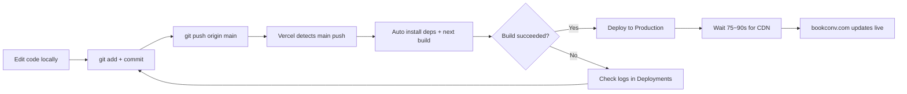

# Onboarding Guide: Deploy from GitHub to Vercel

> Audience: developer just picking up this project (bookconv.com ebook converter site)
> Stack: Next.js (App Router) + TypeScript + Tailwind, hosted on Vercel
> GitHub repo: `doujianwen/ebook-converter`
> Last updated: 2026-08-05

---

## 0. Remember the core flow in one sentence

**Pushing code to GitHub's `main` branch = auto-deploy to production.** No manual packaging, uploading, or restarting needed.

```
Edit code locally → git push origin main → Vercel auto-builds → live in 75~90 seconds
```

### Deployment flowchart



> Other branches (e.g. `dev`, `feature/xxx`) push generate a **Preview** temporary domain and don't affect production. Only `main` triggers a production deploy.

---

## 1. First-time Vercel setup (do once)

### Step 1: Log in and authorize GitHub
1. Open https://vercel.com
2. Log in with your **GitHub account** (first time a popup asks for authorization — allow access to your repos)

### Step 2: Import the repo
1. Dashboard → **Add New → Project**
2. Choose **Import Git Repository**, find `doujianwen/ebook-converter`
   - If it's not in the list, click **Configure GitHub App** to authorize that repo

### Step 3: Configure build settings (verify carefully)
| Setting | What to fill | Notes |
|--------|--------|------|
| Framework Preset | `Next.js` | usually auto-detected |
| **Root Directory** | `ebook-converter` | ⚠️ repo root is `电子书格式转换站/`, the Next.js project is in a subdir; pointing wrong triggers "can't find package.json" |
| Build Command | `next build` | default, don't change |
| Install Command | `npm install` | default |
| Node Version | `20.x` | match local |

### Step 4: Configure environment variables
Path: Project → **Settings → Environment Variables**
Add each item from the "Environment Variables List" below; for Environment check `Production` and `Preview`.

### Step 5: Click Deploy
Wait 1~3 minutes; Vercel generates a `*.vercel.app` temporary domain — verify it opens first.

### Step 6: Bind the custom domain (skip if already done)
1. Settings → **Domains**, add `bookconv.com` and `www.bookconv.com`
2. Follow prompts to point the domain's CNAME to Vercel at your DNS provider (this project uses Cloudflare)
   - Current DNS already points to Vercel IP `216.198.79.1`

---

## 2. Daily updates (what you'll do 90% of the time)

After editing code:

```bash
git add .
git commit -m "feat: your change description"
git push origin main
```

- `main` branch push → triggers **Production** build
- Other branch push → generates **Preview** temporary domain (doesn't affect production, good for testing)
- After build completes **wait 75~90 seconds** before verifying (Vercel cold build + CDN propagation has latency, **successful push ≠ already live**)

### View build status / redeploy
- Dashboard → project → **Deployments** tab: see each build log, click **Redeploy** to re-run
- Local CLI (after `vercel` login): `npx vercel --prod`

---

## 3. Environment variables list (required)

| Variable | Example value | Notes |
|--------|--------|------|
| `NEXT_PUBLIC_APP_URL` | `https://bookconv.com` | production domain |
| `MAX_FILE_SIZE_MB` | `10` | max upload file size |
| `UPLOAD_DIR` | `/tmp/ebook-uploads` | temp file dir (Vercel only `/tmp` is writable) |
| `CLOUD_CONVERT_API_KEY` | (from secret store) | CloudConvert fallback conversion backend, only works after email verified |
| `LEMON_SQUEEZY_API_KEY` | (from secret store) | payments |
| `LEMON_SQUEEZY_STORE_ID` | `438949` | Lemon Squeezy store ID |
| `CORS_ORIGINS` | `https://bookconv.com` | allowed origins |

> Sensitive secrets (payment/conversion API keys) must not be written into code or committed to Git — only stored in the Vercel Dashboard.

### Advanced (only needed when wiring the VPS Calibre backend)
| Variable | Notes |
|--------|------|
| `CONVERSION_BACKEND_URL` | VPS public address, e.g. `http://149.104.69.126` |
| `CONVERSION_INTERNAL_SECRET` | random string matching the VPS side, prevents open-proxy abuse |

---

## 4. Pitfalls every newcomer should know

| Symptom | Root cause | Fix |
|------|------|------|
| Push succeeded but page didn't change | Vercel still building | **wait 90s then verify**, not a failed push |
| Local `next build` errors Turbopack / `os error 80` | symlink issue on Windows | build with `npx next build --webpack` |
| Production API conversion returns 500 | Vercel serverless **has no Calibre binary** | pure-pass-through formats (epub→zip) work; Calibre formats need the VPS backend |
| `/api/health` timeout | Redis unreachable | known symptom, doesn't affect conversion |
| Page title shows "X \| BookConv \| BookConv" double brand | per-page title already has brand suffix | don't write brand suffix in title, global template appends it |
| Chinese page reported "not indexed" | GSC used non-www property to check www page | diagnose with domain property `sc-domain:bookconv.com` |

---

## 5. How to verify after going live

```bash
# Verify homepage HTML is normal (check <title> for double brand)
curl -s https://www.bookconv.com/ | grep -o '<title>[^<]*</title>'

# Verify pure pass-through conversion (epub→zip, runs on Vercel locally)
curl -F "file=@sample.epub" -F "source_format=epub" -F "target_format=zip" \
  https://www.bookconv.com/api/convert -o out.zip
file out.zip   # expect: Zip archive

# Verify Calibre format (only works after wiring VPS backend)
curl -F "file=@sample.epub" -F "source_format=epub" -F "target_format=txt" \
  https://www.bookconv.com/api/convert -o out.txt
```

> Note: in this environment `curl -w "%{http_code}"` occasionally reports a false exit code 23; prefer Node's native `fetch` or `file` to validate the artifact to judge success/failure.

---

## 6. Related docs

- `DEPLOYMENT.md` (project root) — full VPS + Vercel + Cloudflare deployment & wiring plan
- `转换后端接线指南.md` — how Vercel delegates Calibre conversion to VPS
- `诊断_转换管线生产故障_2026-08-04.md` — historical incident retrospective & fix log
- `.workbuddy/memory/MEMORY.md` — project long-term memory (architecture, URL/SEO discipline, fixed defects)

---

## 7. First-day checklist for newcomers

- [ ] Local `git clone` of the repo and `npm install` works
- [ ] `npm run dev` runs, site opens locally
- [ ] Have Vercel project access (ask the owner to add you as collaborator)
- [ ] Understand the three-step "daily update" flow above
- [ ] Remember one iron rule: **push main = go live, wait 90s after editing before verifying**

*When you hit a problem, first check the build logs (Deployments tab), then cross-reference Section 4's troubleshooting table.*
