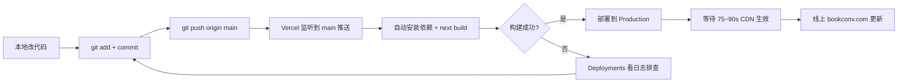

# 新人上手指南：从 GitHub 部署到 Vercel

> 适用对象：刚接手本项目（bookconv.com 电子书转换站）的开发者
> 项目技术栈：Next.js（App Router） + TypeScript + Tailwind，托管在 Vercel
> GitHub 仓库：`doujianwen/ebook-converter`
> 最后更新：2026-08-05

---

## 0. 一句话记住核心流程

**代码 push 到 GitHub 的 `main` 分支 = 自动部署到生产环境。** 不需要手动打包、上传、重启。

```
本地改代码 → git push origin main → Vercel 自动构建 → 75~90 秒后线上生效
```

### 部署流程图



> 其他分支（如 `dev`、`feature/xxx`）push 会生成 **Preview** 临时域名，不影响生产。只有 `main` 才触发生产部署。

---

## 1. 首次接入 Vercel（只需做一次）

### 步骤 1：登录并授权 GitHub
1. 打开 https://vercel.com
2. 用 **GitHub 账号** 登录（首次会弹窗请求授权，允许访问你的仓库）

### 步骤 2：导入仓库
1. Dashboard → **Add New → Project**
2. 选 **Import Git Repository**，找到 `doujianwen/ebook-converter`
   - 若列表里看不到，点 **Configure GitHub App** 给该仓库授权

### 步骤 3：配置构建项（重点核对）
| 配置项 | 填什么 | 说明 |
|--------|--------|------|
| Framework Preset | `Next.js` | 通常自动识别 |
| **Root Directory** | `ebook-converter` | ⚠️ 仓库根目录是 `电子书格式转换站/`，Next 项目在子目录，指错会报"找不到 package.json" |
| Build Command | `next build` | 默认，不用改 |
| Install Command | `npm install` | 默认 |
| Node Version | `20.x` | 与本地保持一致 |

### 步骤 4：配置环境变量
路径：Project → **Settings → Environment Variables**
按下方「环境变量清单」逐条添加，Environment 勾选 `Production` 和 `Preview`。

### 步骤 5：点击 Deploy
等 1~3 分钟，Vercel 会生成一个 `*.vercel.app` 临时域名，先验证能打开。

### 步骤 6：绑定自定义域名（已绑过可跳过）
1. Settings → **Domains**，添加 `bookconv.com` 和 `www.bookconv.com`
2. 按提示去 DNS 商（本项目用 Cloudflare）把域名 CNAME 指向 Vercel
   - 当前 DNS 已指向 Vercel IP `216.198.79.1`

---

## 2. 日常更新（你 90% 的时间在做的事）

改完代码后：

```bash
git add .
git commit -m "feat: 你的改动说明"
git push origin main
```

- `main` 分支 push → 触发 **Production** 构建
- 其他分支 push → 生成 **Preview** 临时域名（不影响生产，适合测试）
- 构建完成后 **等 75~90 秒** 再验证（Vercel 冷构建 + CDN 生效有延迟，**push 成功 ≠ 线上已变**）

### 查看构建状态 / 重新部署
- Dashboard → 项目 → **Deployments** 标签：看每次构建日志、点 **Redeploy** 重跑
- 本地命令行（需登录 `vercel`）：`npx vercel --prod`

---

## 3. 环境变量清单（必填）

| 变量名 | 示例值 | 说明 |
|--------|--------|------|
| `NEXT_PUBLIC_APP_URL` | `https://bookconv.com` | 生产域名 |
| `MAX_FILE_SIZE_MB` | `10` | 最大上传文件大小 |
| `UPLOAD_DIR` | `/tmp/ebook-uploads` | 临时文件目录（Vercel 仅 `/tmp` 可写） |
| `CLOUD_CONVERT_API_KEY` | （从密钥库取） | CloudConvert 降级转换后端，需邮箱已验证才生效 |
| `LEMON_SQUEEZY_API_KEY` | （从密钥库取） | 支付 |
| `LEMON_SQUEEZY_STORE_ID` | `438949` | Lemon Squeezy 店铺 ID |
| `CORS_ORIGINS` | `https://bookconv.com` | 允许的来源 |

> 敏感密钥（支付/转换 API Key）不要写进代码或提交到 Git，只存在 Vercel Dashboard。

### 进阶（接 VPS Calibre 后端时才需要）
| 变量名 | 说明 |
|--------|------|
| `CONVERSION_BACKEND_URL` | VPS 公网地址，如 `http://149.104.69.126` |
| `CONVERSION_INTERNAL_SECRET` | 与 VPS 端一致的随机串，防开放代理 |

---

## 4. 新人必知的「坑」

| 现象 | 根因 | 对策 |
|------|------|------|
| push 成功但页面没变 | Vercel 还在构建 | **等 90 秒再验**，不是没推上 |
| 本地 `next build` 报 Turbopack / `os error 80` | Windows 下软链问题 | 用 `npx next build --webpack` 构建 |
| 生产 API 转换返回 500 | Vercel serverless **无 Calibre 二进制** | 纯透传格式（epub→zip）可用；Calibre 格式需接 VPS 后端 |
| `/api/health` 超时 | Redis 不可达 | 已知现象，不影响转换功能 |
| 页面标题出现「X \| BookConv \| BookConv」双品牌 | per-page title 自带品牌后缀 | title 不要写品牌后缀，全局模板已自动追加 |
| 中文页面被收录报「未收录」 | GSC 用了非 www 属性查 www 页 | 用网域属性 `sc-domain:bookconv.com` 诊断 |

---

## 5. 上线后怎么验证

```bash
# 验证首页 HTML 是否正常（看 <title> 有无双品牌）
curl -s https://www.bookconv.com/ | grep -o '<title>[^<]*</title>'

# 验证纯透传转换（epub→zip，Vercel 本地可跑）
curl -F "file=@sample.epub" -F "source_format=epub" -F "target_format=zip" \
  https://www.bookconv.com/api/convert -o out.zip
file out.zip   # 期望: Zip archive

# 验证 Calibre 格式（接了 VPS 后端才通）
curl -F "file=@sample.epub" -F "source_format=epub" -F "target_format=txt" \
  https://www.bookconv.com/api/convert -o out.txt
```

> 注意：本环境 `curl -w "%{http_code}"` 偶发退出码 23 误报，建议用 Node 原生 `fetch` 或 `file` 校验产物来判断成败。

---

## 6. 相关文档

- `DEPLOYMENT.md`（项目根）— 完整的 VPS + Vercel + Cloudflare 部署与接线方案
- `转换后端接线指南.md` — Vercel 如何委派 Calibre 转换到 VPS
- `诊断_转换管线生产故障_2026-08-04.md` — 历史故障复盘与修复记录
- `.workbuddy/memory/MEMORY.md` — 项目长期记忆（架构、URL/SEO 纪律、已修复缺陷）

---

## 7. 新人第一天 checklist

- [ ] 本地 `git clone` 仓库并能 `npm install`
- [ ] 跑通 `npm run dev`，本地能打开站
- [ ] 有 Vercel 项目访问权限（让负责人加 collaborator）
- [ ] 看懂上面「日常更新」三步流程
- [ ] 记住一条铁律：**push main = 上线，改完等 90 秒再验**

*遇到问题先看构建日志（Deployments 标签），再对照第 4 节排错表。*
