# BookConv Project Retrospective V1 (English)

> **Version**: V1 | **Date**: 2026-08-16 | **Purpose**: Personal / team project archive
> **Scope**: 2026-07-09 inception → 2026-08-15 wrap-up, full development process
> **Data basis**: Full Git history (240 commits) + work logs + GSC measured data; commit hashes verified against Git

---

## 1. Executive Summary

**BookConv** (bookconv.com) is an **e-book format conversion tool site** targeting overseas English-language markets. The core engine is Calibre, with a "free tools + Pro subscription" business model. The project was **initiated on 2026-07-09**, **launched on 2026-07-26**, and had accumulated **240 commits** by 2026-08-15.

### Key Numbers

| Dimension | Value |
|---|---|
| Development cycle | 07-09 inception → 07-26 launch (17 days) → 08-15 (21 days post-launch) |
| Commits | 240 (single linear `main` trunk, no feature branches) |
| Content pages | 36 blogs + 21 guides + 30 convert pages + 1 compat = **88 pages** |
| Supported formats | 28+ e-book format conversions |
| Tech stack | Next.js 16.2.10 / React 19.2.4 / Tailwind 4 / next-intl 4 |
| GSC growth (16 days) | Ranked keywords 3 → 162 (+5300%) |
| Quality gates | Four-loop closure (seo-critic / code-critic / conversion-verifier / git-sync-check) |

### Three Key Conclusions

1. **AI-driven site building works, but quality depends on "gate loops" not "model capability"** — a significant share of the 240 commits were AI-generated. What truly guarantees delivery quality is four deterministic critic gates (structure / code / conversion output / deployment consistency), not model self-awareness.
2. **New-site SEO is a "authority concentration + time compounding" game** — positions 60-80 are a domain-authority problem; on-page optimization ceilings out around 30-40. From 8/9, daily impressions jumped from 18.8 to 132 (+605%) and held, validating the "one page per cluster + internal-link authority concentration" strategy. But 0-click CTR is the current real bottleneck.
3. **Deployment governance is an underestimated hidden battlefield** — Vercel Git repo mismatch + remote orphan branch + insteadOf silently rewriting protocols: three layered hidden issues once made "push success" an illusion. Ultimately rooted out mechanistically via git-sync hard verification + CI consistency gate.

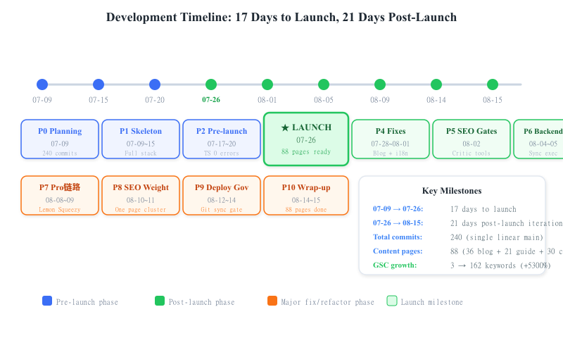
*Fig 1: Development timeline — 17 days to launch + 21 days iteration, four-color phases (blue=planning/skeleton, green=post-launch, orange=major fix)*

---

## 2. Positioning & Tech Stack

### 2.1 Positioning

- **Product**: Online e-book format converter (EPUB / MOBI / AZW3 / PDF / TXT / ZIP interconversion)
- **Market**: Overseas English users primarily, Spanish as second growth pole
- **Business model**: Free tools for traffic + Pro subscription (batch / large files) + Lemon Squeezy payments
- **Core engine**: Calibre (`ebook-convert` CLI), CloudConvert as fallback backend

### 2.2 Tech Stack (verified against package.json on 2026-08-11)

| Category | Dependency | Version |
|---|---|---|
| Framework | Next.js | 16.2.10 (App Router; local build requires `--webpack`) |
| UI | React / React-DOM | 19.2.4 |
| Styling | Tailwind CSS | 4 (+ typography 0.5.20) |
| i18n | next-intl | 4.13.2 |
| Icons | lucide-react | 1.24.0 |
| Validation | zod | 4.4.3 |
| Testing | Jest / Playwright | 30.4.2 / 1.62.1 |
| Queue | bullmq / ioredis | 5.80.2 / 5.11.1 |
| Monitoring | @sentry/nextjs | 10.68.0 |
| Other | @aws-sdk/client-s3, jszip, busboy, sharp | — |
| Deployment | Vercel (production) + Docker (self-hosted alternative) | — |

### 2.3 Architecture Overview: Single-Source Data-Driven

```
Data files (src/data/{blog,guides,content,compat}/*.ts)
        │
        ▼
   index.ts registration (single source of truth)
        │
        ├─→ Listing pages (/blog, /guide, /convert)
        ├─→ sitemap.ts (auto-derived)
        ├─→ RSS feed.xml
        └─→ public/llms.txt (handwritten; three-way consistency check on each addition)
```

**Core constraints**: adding a content page only requires writing the data file + registration; listings/sitemap/RSS derive automatically. Body copy is all English; convert pages have no `es` field (Spanish falls back to English); FAQs use a structured `faqs` field that auto-emits FAQPage JSON-LD.

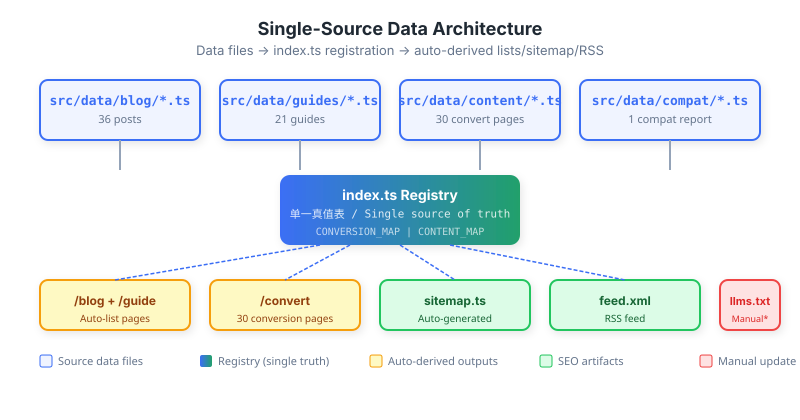
*Fig 2: Single-source architecture — data files + index.ts registration → auto-derived lists/sitemap/rss; llms.txt needs manual sync*

### 2.4 Site Preview

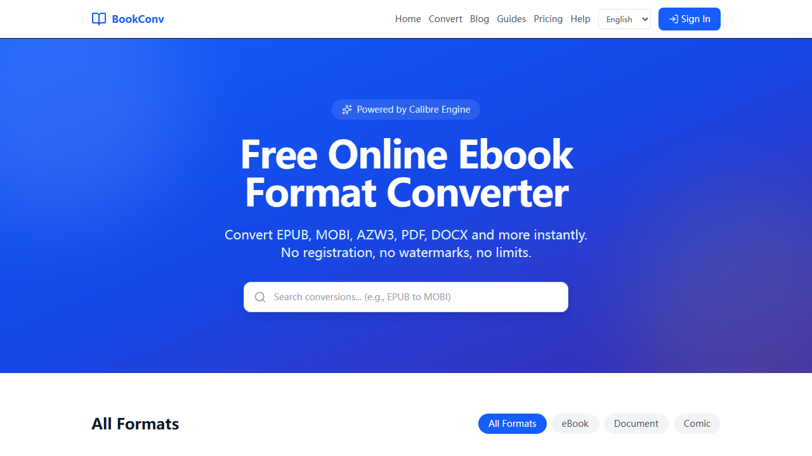
*Fig 6: BookConv homepage — clean conversion entry point + popular tools grid*

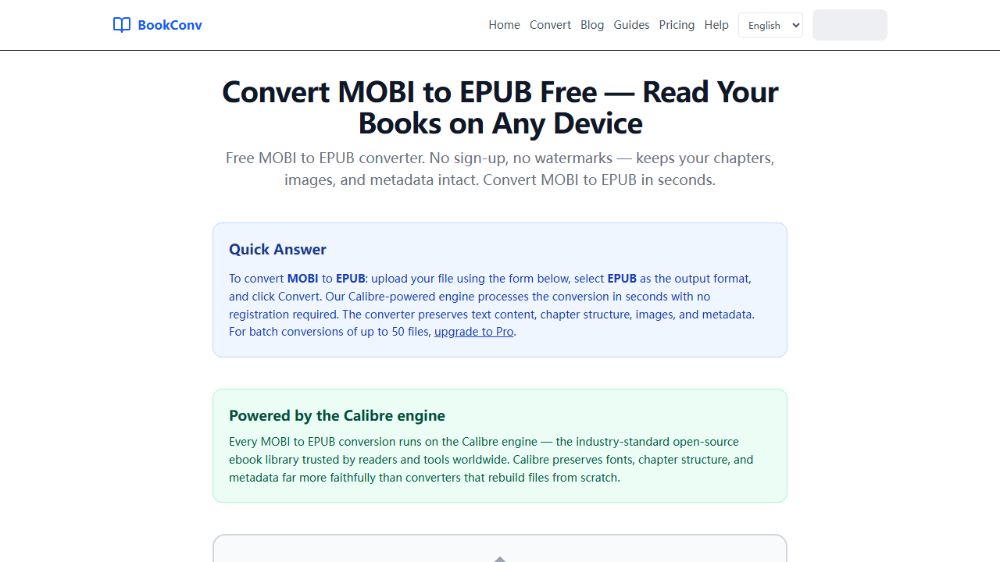
*Fig 7: mobi→epub convert page — upload area + Calibre engine endorsement block*

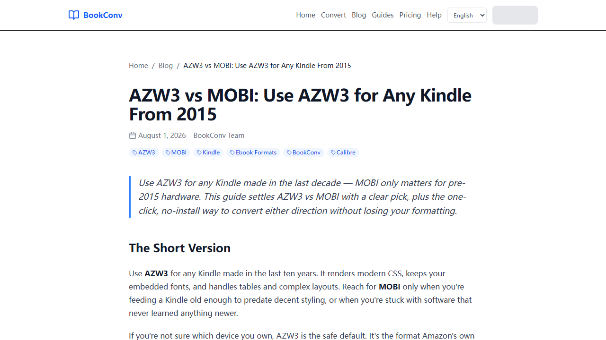
*Fig 8: Blog "AZW3 vs MOBI" — pillar page from the "one page per cluster" strategy, GSC #8.31*

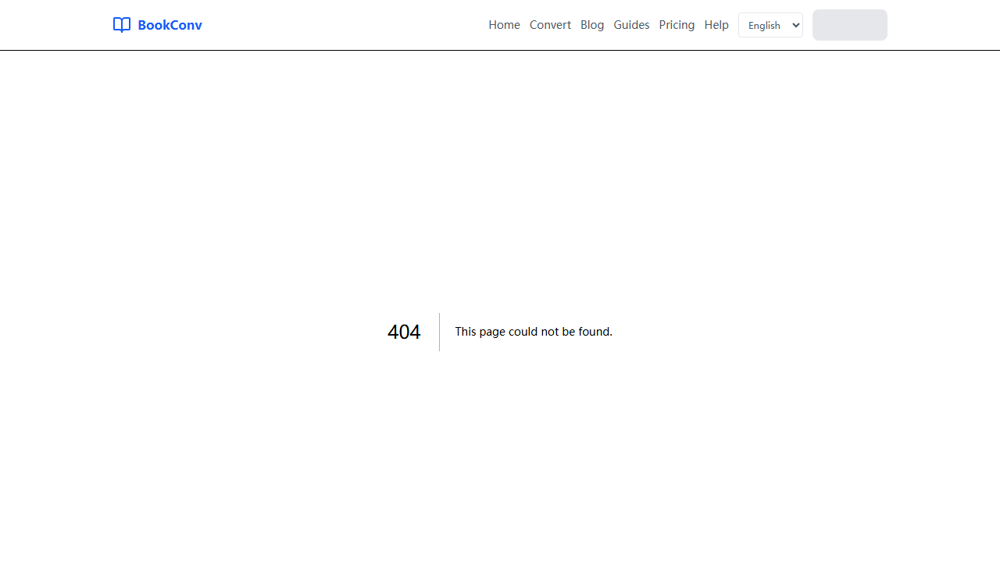
*Fig 9: /compat page — course showcase asset demonstrating real Calibre testing*

---

## 3. Development Timeline (Ten Phases)

### P0 · Inception & Planning (07-09)
- Commit `894ecff`: e-book converter site planning docs + Ahrefs keyword report
- `d47ad57` / `3cbc1a4`: profit-space analysis + competitor deep-dive (online-convert.com / ebook2pdf.com)
- `472c68a`: expert review — 14 core issues & improvement plan
- **Decision**: keyword-data-driven selection; tool-site model, not content-site

### P1 · Full-Stack Skeleton (07-09 ~ 07-15)
- `fcac0a5`: Next.js full project — 28 tool pages + Worker/Docker + components
- `7459e98`: EPUB→HTML uses `.htmlz` extension per Calibre spec
- `a3628aa`: API route fixes + real conversion pipeline verified
- `7104406`: i18n + Service Worker + PWA + queue refactor
- `973bc21` / `2661d4a`: Dockerfile + health-check endpoint
- `c054338` / `3098f03`: DEPLOYMENT.md (VPS + Nginx + SSL) + README

### P2 · Pre-Launch QA (07-17 ~ 07-20)
- `9f2d25d`: TypeScript errors cleared (75 → 0)
- `8a876fb`: GEO optimization — QAPage schema + Quick Answer section
- `6d6c282` / `145a91b`: error-correction audit 21 fixes + CI audit pipeline
- `8782a0f`: pre-launch QA — compile errors, test suite, queue worker, e2e

### P3 · Official Launch (07-26) ★
- `c299770`: email/password auth + FAQ schema fix + Lemon Squeezy config
- `3898bdb`: Sentry + Feishu alerts + enhanced health check + security headers + Plausible
- `b1b6e34` / `9494e0e` / `0b67bda`: GA4 + CSP allowlist + FAQPage JSON-LD field fix
- `88a8d0e`: **initial frontend release — BookConv UI (28+ formats, i18n, PWA, SEO)** ★ launch

### P4 · Early Post-Launch Fixes (07-28 ~ 08-01)
- `7f2b410`: English SEO/GEO blog posts for US market
- `0b88c10`: localePrefix as-needed — English URLs without `/en` (key SEO decision)
- `8c69896`: invalid convert slugs return real 404 (soft-404 fix)
- `6123911` / `88635ee`: blog slug `-en` suffix removed
- `4ca19e3` / `ceb6395`: rewrote all 10 blog posts to match new renderer + de-AI-ify
- `ebb3482`: 15 shallow convert landing pages expanded to 70-100 lines

### P5 · SEO / CI Gates Take Shape (08-02)
- `1aa6643`: conversion output verification gate (pure-critic layer)
- `4058759`: SEO/link/i18n critic as automated CI gate (#2)
- `8f9bfda`: code-critic gate against AI-hallucination damage (#3)
- `6bb3be3`: 13 blog posts FAQ structured + FAQPage JSON-LD
- `bed377d` / `85c1cc1` / `1d5c273`: pain-point guide pages (/guide) P1/P2/P3
- `e437897`: llms.txt full coverage + entity structured data
- `2b6321c` / `74fee62`: P1 early-win + 22 P0 convert page title/meta rewrites

### P6 · Conversion Backend Rebuild (08-04 ~ 08-05)
- `0bc2b77`: in-request synchronous conversion on Vercel (maxDuration=60, Redis-decoupled)
- `7aeb96a`: pure-JS EPUB→TXT extraction (no Calibre needed)
- `c2be036`: EPUB→ZIP passthrough + result delivery bridge fix
- `0c2ca41` / `c1faadb` / `548603d`: CloudConvert integrated as Calibre fallback
- `c17ce7c`: CloudConvert 402/429 throttle retry

### P7 · Dependency Removal & Pro Chain (08-08 ~ 08-09)
- `8aa4a68`: **removed Supabase dependency**
- `a1e9aa8` / `b8b0c4a`: batch conversion actually works (browser-side loop) + quota guardrails
- `0d15c34`: **fixed Pro subscription chain** — checkout writes `custom_data.email`, webhook keyed by email, added `getPlanByEmail()`, redis supports `rediss://`; `/batch` Pro gate added ★
- `ec2ec4f`: docs unified — merged `ebook-converter/docs` into root `docs/`
- `3a1f246`: blog grew 26 → 36 posts
- `8381565`: visible Calibre engine endorsement block

### P8 · SEO Dedup & Authority Concentration (08-10 ~ 08-11)
- `50a90a2`: consolidated mobi↔epub cluster (Item 4 one-page-per-cluster)
- `f6a8a1d` / `a02df6d`: R1/R2 merges — `epub-vs-azw3-vs-mobi` → `ebook-formats-explained`; `mobi-vs-azw3` trio → `azw3-vs-mobi`
- `ce07086` / `4f6a13b`: R4/R5 Kindle sub-cluster — `kindle-formats` as pillar
- `5e8eacc`: conversion compatibility report pages (/compat, course showcase asset)
- `a16e50e`: internal-link authority concentrated to `/convert/mobi-to-epub`
- `bb31ce9`: GSC indexing diagnostic report

### P9 · Deployment Governance (08-12 ~ 08-14)
- `c0fa591`: **git-sync hard-verify script + deploy SOP** (root-cause fix) — after push, query GitHub directly via `git ls-remote` to compare remote main == local HEAD; does not trust the easily-faked behind=0
- `34e6b2a`: CI deployment-consistency gate (deploy.yml adds `deploy-consistency` job)
- `8deca63`: **fixed Pro variant format bug** — `getPlanByVariantId` strictly compared env `v_1947491` vs webhook integer `1947491` → never matched → subscription saved but `/batch` permanently locked; both sides `normalizeVariantId` strip `v_` prefix ★
- `8247d8f`: pro-e2e-check script hardened
- `a933e7e` / `637f28f` / `f93dbae`: **Vercel auto-deploy link fix** — confirmed pointing to `bookconv-frontend`; CI moved to repo root so GitHub actually runs it
- `ecf9ad5`: GA4 conversion event instrumentation

### P10 · Wrap-up & Data (08-14 ~ 08-15)
- `ad6e548`: GSC 2026-08-14 daily analysis (keyword trend hits 204)
- `9f80ff0`: 0-click page title/meta fixes
- `77636b3` / `806a9b8` / `bc24d1f` / `90b4bef`: /help aggregate page + large-file guide + quality-check guide + multi-device sync + content-gap backfill
- `90b4bef`: GEO citation tracker's 4 "gaps" were actually stale DB state (already published); backfilled `content_gaps` table

---

## 4. Core Outcomes & Data

### 4.1 Content Scale

| Section | Data source | Count |
|---|---|---|
| /blog | src/data/blog | 36 posts |
| /guide | src/data/guides | 21 posts |
| /convert | CONVERSION_MAP + src/data/content | 30 pairs |
| /compat | src/data/compat | 1 entry |
| Internal links | editorial | 185 (0 generic anchor text) |

### 4.2 GSC Data Evolution (7/25 – 8/11, 18 days of valid data)

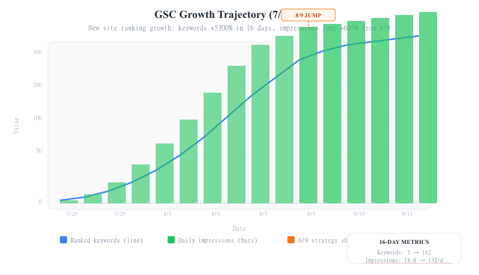
*Fig 3: GSC growth curve — keywords 3→162 (+5300%), impressions jump to 132/day from 8/9 (+605%), but CTR remains 0%*

> Live GSC report screenshot (8/5 export data, 5 Chart.js charts):
> 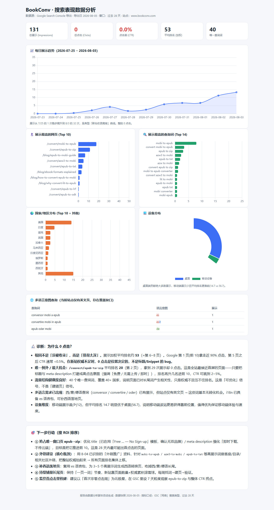

> Daily trend report (8/13, 4 canvas charts):
> 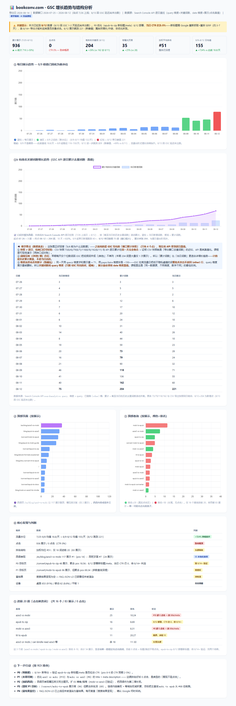

| Metric | Value | Interpretation |
|---|---|---|
| Total impressions | 716 | Pre-8/9 daily avg 18.8 → from 8/9 daily avg 132 (+605%); step-growth held |
| Ranked keywords | 3 → 162 (16 days) | Significant new-site ramp-up |
| Weighted avg position | #51 | Long-tail 146 keywords at 50-90 is normal |
| Clicks | 0 | **CTR=0% is the current real bottleneck** |
| Top 16 keywords | top-20 / 83 impressions / 0 clicks | Rankings in place but titles/descriptions don't earn clicks |

**Spanish second growth pole**: `/es/blog/azw3-vs-mobi` hit 117 impressions (pos 14.34, the site's best); the English equivalent had only 2 impressions. Spain #7 (24 impressions). ES localization works and should be the second growth pole.

### 4.3 Four-Loop Quality Gates

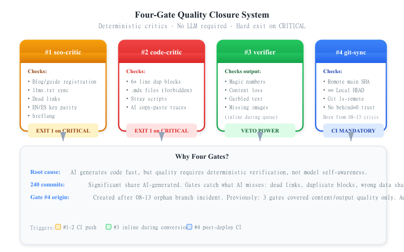
*Fig 4: Four-gate quality closure — seo-critic (yellow) / code-critic (red) / conversion-verifier (green) / git-sync-check (blue), CRITICAL veto power*

| Gate | Script | Responsibility | Trigger |
|---|---|---|---|
| #1 seo-critic | seo-critic.mjs | blog/guide registration convergence, llms.txt sync, dead links, EN/ES keys, hreflang | CRITICAL exit 1 |
| #2 code-critic | code-critic.mjs | 6-line duplicate blocks (AI copy marks), `.mdx`, stray scripts | CRITICAL exit 1 |
| #3 conversion-verifier | conversion-verifier.ts | conversion output magic-numbers/content-loss/garbled/images | CRITICAL veto (inline) |
| #4 git-sync-check | git-sync-check.mjs | remote main SHA == local HEAD (deployment actually landed) | mismatch exit 1 (CI-enforced) |

> The fourth gate is a direct product of the 08-13 orphan-branch incident — previously critics only covered "content/output quality," not "whether deployment actually landed."

---

## 5. Key Technical Decisions & Architecture

### 5.1 Single-Source Data-Driven
Data files + index.ts registration → listings/sitemap/rss auto-derived. A single source of truth (CONVERSION_MAP / CONTENT_MAP) prevents multi-list drift. Once, because consumers read flat while values were module namespaces, 27 pages fell back to default templates (see §6).

### 5.2 Conversion Pipeline (Calibre + CloudConvert + verifier)
- Production: `src/lib/conversion.ts` in-request synchronous execution (maxDuration=60), decoupled from queue/Redis
- Backend: `ebook-convert` CLI primary, CloudConvert fallback (402/429 retry)
- Pure-JS paths: EPUB→TXT / EPUB→ZIP need no Calibre
- Critic layer: `conversion-verifier.ts` deterministic rules, one-vote veto (magic-numbers / content loss / garbled / image loss)

### 5.3 i18n localePrefix as-needed
- English has no prefix (`/` not `/en`), Spanish `/es`
- Middleware rewrites `/en/*` → 301
- canonical is always `locale === 'es' ? '/es' : ''`, never hardcoded `/en`
- Global title template auto-appends `| BookConv`; per-page titles carry no suffix

### 5.4 Pro Payment Chain (Lemon Squeezy + Upstash Redis)
- webhook uses `custom_data.email` as subscription key
- `getPlanByEmail()` / `getPlanByVariantId()` dual query
- `/batch` Pro gate
- Prerequisite: Vercel must set `REDIS_URL` = Upstash `rediss://` (TCP, not REST `https://`)

---

## 6. Major Defects & Root-Cause Fixes (6 Selected)

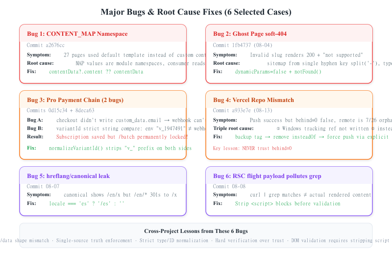
*Fig 5: Six major bugs — CONTENT_MAP unwrap / soft-404 / dual Pro bugs / Vercel mismatch / hreflang leak / RSC payload pollution*

### 6.1 CONTENT_MAP Namespace Unwrapping (a2676cc)
- **Symptom**: 27 pages' custom body/FAQ all fell back to default templates
- **Root cause**: CONTENT_MAP values are module namespaces (nested `content:{hero,sections,faq}`), consumed as flat
- **Fix**: unwrap at page.tsx pass-through: `contentData?.content ?? contentData`

### 6.2 Phantom-Page Soft-404 (08-04)
- **Symptom**: invalid slugs rendered 200 + "not supported" → title/content contradiction is a demotion signal
- **Root cause**: sitemap/routes derived from CONVERSION_MAP single-hyphen key `split('-')`, mis-spelling `epub-docx` into sitemap
- **Fix**: `dynamicParams=false` + `notFound()`; sitemap/staticParams derive from CONTENT_MAP canonical slugs (1fb4737)

### 6.3 Two Fatal Pro-Chain Bugs (0d15c34 + 8deca63)
- **Bug 1** (0d15c34): checkout didn't write `custom_data.email` → webhook couldn't associate user → subscription not saved
- **Bug 2** (8deca63): `getPlanByVariantId` strictly compared env `v_1947491` vs webhook integer `1947491` → never matched → subscription saved but `getPlanByEmail` always returned `free`, `/batch` permanently locked
- **Fix**: both sides `normalizeVariantId` strip `v_` prefix; signature-length mismatch returns false (401) gracefully instead of throwing 500
- **Verification**: pro-e2e-check.mjs passed 8/8 online E2E

### 6.4 Vercel Repo Mismatch + Orphan-Branch Force-Push (08-13)
- **Symptom**: after push, `behind=0` falsely indicated sync; remote was actually a 7/26 orphan branch (disjoint history from local)
- **Three root causes**: ① weak proxy metric (behind depends on local tracking ref, which Windows may fail to persist → FALSE behind=0); ② insteadOf silently rewrote SSH to HTTPS, making push fail under illusion of success; ③ Vercel Git link pointed to old repo `doujianwen/ebook-converter` instead of real `doujianwen/bookconv-frontend`
- **Fix**: tag backup `pre-rebase-backup` → remove insteadOf → explicit `ssh://` force-push → `git ls-remote` hard-verify → encapsulate as git-sync-check.mjs + CI gate
- **Lesson**: **after push, always hard-verify; never trust behind=0**

### 6.5 hreflang/canonical Leak (08-07)
- **Symptom**: canonical leaked to `/en/x` after middleware rewrite (because `getLocale()`=en), while `/en/*` 301-redirects
- **Root cause**: canonical used `${'/' + locale}`; hreflang inheritance chain only inspected the middle, missing root/non-locale routes
- **Fix**: always `locale === 'es' ? '/es' : ''`; per-page curl-verify `<link rel=alternate>`

### 6.6 DOM Verification Polluted by RSC Flight Payload (08-08)
- **Symptom**: `curl | grep 'xxx'` matched ≠ page actually rendered
- **Root cause**: Next RSC flight payload (`<script>`-embedded serialized props) pollutes grep matches
- **Fix**: always strip `<script>` blocks before verifying DOM: `html.replace(/<script[\s\S]*?<\/script>/g,'')`

---

## 7. Pitfalls & Lessons (41 Selected by Category)

> Full 41 entries in `pitfalls-learning-report-2026-08-09.md`. Selected here by category with cross-project value noted.

### 7.1 Environment / Tooling Pitfalls (highest recurrence, E1-E15)
- **E2**: Windows local Turbopack junction bug with @aws-sdk symlinks → local build must use `--webpack`
- **E3/E4**: Git Bash has no `sleep`/`seq`; `/tmp` invisible to native Python
- **E5/E6**: `[locale]` bracket paths are wildcards in git pathspec — use `./` prefix
- **E7**: sandbox `rm`/`fs.rmSync` blocked by safe-delete shim → delete CJK paths via Windows absolute path + Node; verify with `ls` after blocking (may already be in recycle bin)

### 7.2 Build / Deploy Verification Pitfalls (B1-B6)
- **B1**: **push ≠ build success**; unchanged behavior = Vercel build failed → wait 75-90s after push, then curl-verify
- **B3**: always strip `<script>` blocks before DOM verification (see §6.6)
- **B6**: global `title.template` auto-appends `| BookConv`; per-page carrying brand → double-brand

### 7.3 Code / Architecture Pitfalls (C1-C12, project-specific, fixed)
- **C1**: CONTENT_MAP namespace unwrapping (see §6.1)
- **C3**: CTA URL missing `to` (`/convert/lit-epub`) → 500; rule: `/convert/{src}-to-{tgt}`
- **C8**: broken-link repair targets must be verified against CONVERSION_MAP, not guessed (once introduced a 404)

### 7.4 Process / Judgment Pitfalls (J1-J9, chat layer)
- **J1**: conceptual assumption without verification (mistook "correction agent" for doudouma-improve) → always conversation_search + Glob + read-file triple-verify first
- **J3**: misreading GSC status ("queued" as "not indexed") → rule: has impressions = indexed
- **J5**: **faking data to fool oneself** (filling Queue counts with Math.random()) → report unknown when data unavailable, never fabricate

### 7.5 Seven Hard Rules Promoted Cross-Project
1. Always strip `<script>` blocks before DOM verification
2. Report unknown when data unavailable, never fabricate
3. Verify suspicious facts first (conversation_search/Glob/Read always beats "I remember")
4. Self-check sums on any amount breakdown
5. Sandbox delete blocked ≠ not deleted; verify with ls
6. Check Windows/Git Bash environment differences before writing commands
7. After push, always wait for deployment then curl-verify

---

## 8. Current Status & Residual Risks

### 8.1 Closed
- ✅ Pro chain E2E verification (8/8 passed, 8deca63)
- ✅ Vercel repo mismatch fixed (a933e7e / 637f28f)
- ✅ Deployment-consistency gate in CI (34e6b2a)
- ✅ Docs unified (ec2ec4f)
- ✅ Conversion output verification landed (conversion-verifier.ts)

### 8.2 Residual Risks (must keep watching)
- ⚠️ **User-storage persistence**: `storage.ts` uses an in-memory Map; Vercel doesn't persist across requests → intermittent login failures. Recommended migration to Supabase/Postgres (not done; large refactor)
- ⚠️ **Untrue claim not cleared**: pricing says Pro "Up to 50MB" but convert-handler.ts hardcodes 10MB. New copy must not restate 50MB
- ⚠️ **Calibre output verification depth**: current verifier is deterministic-rules v1; lacks an LLM semantic layer
- ⚠️ **GSC rich results empty**: FAQ JSON-LD deployed but not yet rendered; awaiting Google crawl
- ⚠️ **0-click CTR bottleneck**: top-16 keywords reach top-20 yet 0 clicks; title/description optimization is the next battleground

---

## 9. Next-Step Recommendations (by ROI)

| Priority | Action | Expected gain |
|---|---|---|
| P0 | Optimize top-16 keywords (azw3 vs mobi #10 / mobi vs azw3 #8 / lit to epub #20) title+meta | Directly attack the 0-click bottleneck; unlock first organic traffic |
| P0 | Keep deepening `/convert/mobi-to-epub` (96 impressions, main battleground) + backlink building | Reaching page 1 needs backlinks; positions 60-80 are a domain-authority problem |
| P1 | Double down on Spanish content (azw3-vs-mobi already pos 14.34) | Second growth pole; low competition, high return |
| P1 | User-storage persistence refactor (Supabase/Postgres) | Root-fix intermittent login; close the Pro experience loop |
| P2 | Align pricing 50MB with actual 10MB | Eliminate untrue-claim risk |
| P2 | GA4 conversion-funnel data review (landing → upload → complete) | Instrumented 2026-08-10; first funnel analysis now possible |

---

## Appendix A: Key Commit Index (by phase)

| Phase | Representative commit | Note |
|---|---|---|
| P0 | 894ecff / 472c68a | Inception planning + expert review |
| P1 | fcac0a5 / 7104406 | Full-stack skeleton + i18n/PWA |
| P2 | 9f2d25d / 8782a0f | TS cleared + pre-launch QA |
| P3 | 88a8d0e | ★ Official launch |
| P4 | 0b88c10 / 8c69896 | localePrefix + soft-404 fix |
| P5 | 1aa6643 / 4058759 / 8f9bfda | Three critic gates take shape |
| P6 | 0bc2b77 / 0c2ca41 | Sync conversion + CloudConvert |
| P7 | 8aa4a68 / 0d15c34 / ec2ec4f | Supabase removed + Pro fix + docs unified |
| P8 | 50a90a2 / 5e8eacc | One-page-per-cluster + compat page |
| P9 | c0fa591 / 34e6b2a / 8deca63 / a933e7e | Deployment-governance quartet |
| P10 | 90b4bef / ecf9ad5 | Content backfill + GA4 events |

## Appendix B: Core File Inventory

**Core lib**
- `src/lib/conversion.ts`: in-request synchronous conversion execution layer
- `src/lib/conversion-verifier.ts`: conversion output verifier (one-vote veto)
- `src/lib/internal-links.ts`: related blog/guide recommendation resolver
- `src/lib/conversion-map.ts`: CONVERSION_MAP single source of truth

**Gate scripts (scripts/)**
- `seo-critic.mjs` / `code-critic.mjs` / `git-sync-check.mjs` / `pro-e2e-check.mjs`

**Data (src/data/)**
- `blog/*.ts` (36) / `guides/*.ts` (21) / `content/*.ts` (30) / `compat/*` (1)

**Config**
- `next.config.ts` (compress:true) / `src/middleware.ts` (i18n en/es) / `src/app/sitemap.ts`

---

> **Closing note**: BookConv went from inception to launch in 17 days, then iterated for 21 days to 88 pages + a four-gate closure loop — validating the "AI site-building + gate backstop" model. What truly decides delivery quality is not model capability but the mechanistic loop of deterministic critics and deployment hard-verification. The next phase's decisive factors are CTR optimization and backlink building — rankings are largely in place; what's missing is clicks and authority.
