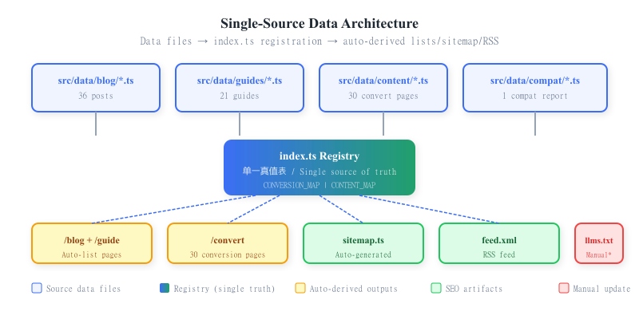

# BookConv 项目复盘 V1（中文版）

> **版本**：V1 ｜ **日期**：2026-08-16 ｜ **定位**：个人/团队项目档案
> **范围**：2026-07-09 立项 → 2026-08-15 收尾，覆盖完整开发过程
> **数据基准**：Git 全量历史（240 提交）+ 工作日志 + GSC 实测，commit hash 以 Git 实测为准

---

## 一、执行摘要

**BookConv**（bookconv.com）是一个面向海外英文市场的**电子书格式转换工具站**，核心引擎为 Calibre，采用「工具免费 + Pro 订阅」商业模式。项目于 **2026-07-09 立项**，**2026-07-26 正式上线**，截至 2026-08-15 共迭代 **240 次提交**。

### 关键数字卡

| 维度 | 数值 |
|---|---|
| 开发周期 | 07-09 立项 → 07-26 上线（17 天）→ 08-15（上线后 21 天） |
| 代码提交 | 240 次（单 `main` 线性主干，无 feature 分支） |
| 内容页规模 | 36 博客 + 21 指南 + 30 转换页 + 1 compat = **88 页** |
| 支持格式 | 28+ 种电子书格式互转 |
| 技术栈 | Next.js 16.2.10 / React 19.2.4 / Tailwind 4 / next-intl 4 |
| GSC 增长（16 天）| 有排名关键词 3 → 162（+5300%）|
| 质量门禁 | 四道闭环（seo-critic / code-critic / conversion-verifier / git-sync-check）|

### 三大结论

1. **AI 驱动建站可行，但质量靠"门禁闭环"而非"模型能力"**——240 提交中相当比例为 AI 生成，真正保证交付质量的是四道确定性 critic 门禁（结构/代码/转换输出/部署一致性），而非模型自觉。
2. **新站 SEO 是"权重集中 + 时间复利"游戏**——位置 60-80 是域名权威问题，页面优化天花板约 30-40；8/9 起日均展示从 18.8 跃升至 132（+605%）并固化，验证了"一页吃整簇 + 内链集权"策略有效，但 0 点击 CTR 是当前真实瓶颈。
3. **部署治理是被低估的隐形战场**——Vercel Git 仓库错位 + 远程孤儿分支 + insteadOf 偷改协议，三重隐蔽问题曾让"push 成功"成为假象；最终靠 git-sync 硬验证 + CI 一致性门禁从机制上根治。


*图 1：开发时间线——17 天上线 + 21 天迭代，四色阶段划分（蓝=规划/骨架、绿=上线后、橙=重大修复）*

---

## 二、项目定位与技术栈

### 2.1 定位

- **产品**：电子书格式在线转换工具（EPUB / MOBI / AZW3 / PDF / TXT / ZIP 等互转）
- **市场**：海外英文用户为主，西语为第二增长极
- **商业模式**：免费工具引流 + Pro 订阅（批量转换 / 大文件）+ Lemon Squeezy 支付
- **核心引擎**：Calibre（`ebook-convert` CLI），CloudConvert 作为兜底后端

### 2.2 技术栈版本（2026-08-11 核对 package.json）

| 类别 | 依赖 | 版本 |
|---|---|---|
| 框架 | Next.js | 16.2.10（App Router，本地构建须 `--webpack`）|
| UI | React / React-DOM | 19.2.4 |
| 样式 | Tailwind CSS | 4（+ typography 0.5.20）|
| i18n | next-intl | 4.13.2 |
| 图标 | lucide-react | 1.24.0 |
| 校验 | zod | 4.4.3 |
| 测试 | Jest / Playwright | 30.4.2 / 1.62.1 |
| 队列 | bullmq / ioredis | 5.80.2 / 5.11.1 |
| 监控 | @sentry/nextjs | 10.68.0 |
| 其他 | @aws-sdk/client-s3、jszip、busboy、sharp | — |
| 部署 | Vercel（生产）+ Docker（自托管备选）| — |

### 2.3 架构概览：单源数据驱动


*图 2：单源数据架构——数据文件 + index.ts 注册 → 列表/sitemap/rss 自动派生，llms.txt 需手动同步*

```
数据文件 (src/data/{blog,guides,content,compat}/*.ts)
        │
        ▼
   index.ts 注册（单一真值表）
        │
        ├─→ 列表页（/blog, /guide, /convert）
        ├─→ sitemap.ts（自动派生）
        ├─→ RSS feed.xml
        └─→ public/llms.txt（手写，每次新增做三数一致校验）
```

**核心约束**：新增内容页只需写数据文件 + 注册，列表/sitemap/RSS 自动派生；正文全英文；转换页无 es 字段（西语回退英文）；FAQ 用结构化 `faqs` 字段自动发 FAQPage JSON-LD。

### 2.4 网站预览


*图 6：BookConv 首页——简洁的转换入口 + 热门工具网格*


*图 7：mobi→epub 转换页——上传区 + Calibre 引擎背书区块*


*图 8：博客《AZW3 vs MOBI》——一页吃整簇策略的支柱页，GSC #8.31*


*图 9：/compat 兼容性报告页——课程 showcase 资产，展示 Calibre 真跑实测*

---

## 三、开发时间线（十阶段）

### P0 · 立项与规划（07-09）
- 提交 `894ecff`：电子书转换工具站规划文档 + Ahrefs 关键词数据报告
- `d47ad57` / `3cbc1a4`：利润空间分析 + 竞品深度分析（online-convert.com / ebook2pdf.com）
- `472c68a`：专家审查 14 个核心问题与改进方案
- **决策**：以关键词数据驱动选品，工具站模型而非内容站

### P1 · 全栈骨架（07-09 ~ 07-15）
- `fcac0a5`：Next.js 全项目——28 工具页 + Worker/Docker + 组件
- `7459e98`：EPUB→HTML 按 Calibre 规范用 `.htmlz` 扩展名
- `a3628aa`：API 路由修复 + 真实转换链路验证通过
- `7104406`：i18n + Service Worker + PWA + 队列重构
- `973bc21` / `2661d4a`：Dockerfile + 健康检查端点
- `c054338` / `3098f03`：DEPLOYMENT.md（VPS + Nginx + SSL）+ README

### P2 · 上线前 QA（07-17 ~ 07-20）
- `9f2d25d`：TypeScript 错误清零（75 → 0）
- `8a876fb`：GEO 优化——QAPage schema + Quick Answer 区块
- `6d6c282` / `145a91b`：error-correction 审计 21 项修复 + CI 审计管线
- `8782a0f`：上线前 QA——编译错误、测试套件、队列 worker、e2e 全流程

### P3 · 正式上线（07-26）★
- `c299770`：邮箱/密码认证 + FAQ schema 修复 + Lemon Squeezy 配置
- `3898bdb`：Sentry + 飞书告警 + 增强健康检查 + 安全头 + Plausible
- `b1b6e34` / `9494e0e` / `0b67bda`：GA4 + CSP 放行 + FAQPage JSON-LD 补字段
- `88a8d0e`：**initial frontend release — BookConv UI（28+ 格式, i18n, PWA, SEO）** ★ 上线

### P4 · 上线初期修复（07-28 ~ 08-01）
- `7f2b410`：引入英文 SEO/GEO 博客（US 市场）
- `0b88c10`：localePrefix as-needed——英文 URL 不带 `/en`（关键 SEO 决策）
- `8c69896`：无效 convert slug 返回真 404（修 soft-404）
- `6123911` / `88635ee`：博客 slug 去 `-en` 后缀
- `4ca19e3` / `ceb6395`：重写全部 10 篇博客匹配新渲染器 + 去 AI 腔
- `ebb3482`：15 个浅转换着陆页扩到 70-100 行

### P5 · SEO/CI 闸门成型（08-02）
- `1aa6643`：转换输出验证闸门（pure-critic 层）
- `4058759`：SEO/链接/i18n critic 作为自动化 CI 门禁（#2）
- `8f9bfda`：code-critic 门禁防 AI 幻觉损害（#3）
- `6bb3be3`：13 篇博客 FAQ 结构化 + FAQPage JSON-LD
- `bed377d` / `85c1cc1` / `1d5c273`：痛点指南页（/guide）P1/P2/P3
- `e437897`：llms.txt 全量覆盖 + 实体结构化数据
- `2b6321c` / `74fee62`：P1 early-win + 22 页 P0 转换页 title/meta 改写

### P6 · 转换后端重构（08-04 ~ 08-05）
- `0bc2b77`：Vercel 上请求内同步执行转换（maxDuration=60，去 Redis 依赖）
- `7aeb96a`：纯 JS EPUB→TXT 提取（无需 Calibre）
- `c2be036`：EPUB→ZIP 直通 + 结果交付桥修复
- `0c2ca41` / `c1faadb` / `548603d`：集成 CloudConvert 作为 Calibre 兜底后端
- `c17ce7c`：CloudConvert 402/429 限流重试

### P7 · 去依赖与 Pro 链路（08-08 ~ 08-09）
- `8aa4a68`：**移除 Supabase 依赖**
- `a1e9aa8` / `b8b0c4a`：批量转换真正可用（浏览器端循环）+ 配额护栏
- `0d15c34`：**修复 Pro 订阅链路**——checkout 写 `custom_data.email`、webhook 改 email 为键、加 `getPlanByEmail()`、redis 支持 `rediss://`；`/batch` 加 Pro 门禁 ★
- `ec2ec4f`：文档统一——合并 `ebook-converter/docs` 进根 `docs/`（注：记忆曾误记为 `ec2ec4f8`，实测为 `ec2ec4f`）
- `3a1f246`：博客从 26 → 36 篇
- `8381565`：可见的 Calibre 引擎背书区块

### P8 · SEO 去重集权（08-10 ~ 08-11）
- `50a90a2`：整合 mobi↔epub 簇（Item 4 一页吃整簇）
- `f6a8a1d` / `a02df6d`：R1/R2 合并——`epub-vs-azw3-vs-mobi` → `ebook-formats-explained`；`mobi-vs-azw3` 三页争 → `azw3-vs-mobi`
- `ce07086` / `4f6a13b`：R4/R5 Kindle 子簇立 `kindle-formats` 为支柱
- `5e8eacc`：新增 conversion compatibility 报告页（/compat，课程 showcase 资产）
- `a16e50e`：内链集权到 `/convert/mobi-to-epub`
- `bb31ce9`：GSC 索引诊断报告

### P9 · 部署治理（08-12 ~ 08-14）
- `c0fa591`：**git-sync 硬验证脚本 + 部署 SOP**（根因修复）——push 后用 `git ls-remote` 直问 GitHub 比对远程 main == 本地 HEAD，不依赖易假的 behind=0
- `34e6b2a`：CI 部署一致性门禁（deploy.yml 加 `deploy-consistency` 作业）
- `8deca63`：**修复 Pro 变体格式 bug**——`getPlanByVariantId` 严格比对 env 值 `v_1947491` 与 webhook 实际整数 `1947491` 永不匹配 → 订阅存下但 `/batch` 永久锁死；两侧 `normalizeVariantId` 去 `v_` 前缀 ★
- `8247d8f`：pro-e2e-check 脚本加固
- `a933e7e` / `637f28f` / `f93dbae`：**Vercel 自动部署链路修复**——确认指向 `bookconv-frontend`，CI 移到仓库根让 GitHub 真正运行
- `ecf9ad5`：GA4 转化事件埋点

### P10 · 收尾与数据（08-14 ~ 08-15）
- `ad6e548`：GSC 2026-08-14 日常分析（关键词趋势达 204）
- `9f80ff0`：0 点击页 title/meta 修复
- `77636b3` / `806a9b8` / `bc24d1f` / `90b4bef`：/help 聚合页 + 大文件指南 + 质量检查指南 + 多设备同步 + 内容缺口回填
- `90b4bef`：GEO 引用追踪报告 4 个"缺口"实为数据库状态未回写（早已发布），回填 `content_gaps` 表

---

## 四、核心成果与数据指标

### 4.1 内容规模

| 区块 | 数据来源 | 数量 |
|---|---|---|
| /blog | src/data/blog | 36 篇 |
| /guide | src/data/guides | 21 篇 |
| /convert | CONVERSION_MAP + src/data/content | 30 对 |
| /compat | src/data/compat | 1 条 |
| 内链 | 编辑内链 | 185 条（通用锚文本 0 条）|

### 4.2 GSC 数据演进（7/25 – 8/11，18 天有效数据）


*图 3：GSC 增长曲线——关键词从 3 增至 162（+5300%），8/9 展示跃升至日均 132（+605%），但 CTR 始终为 0%*

> 实时 GSC 报告截图（8/5 导出数据，含 5 个 Chart.js 图表）：
> 

> 每日趋势报告（8/13，4 个 canvas 图表）：
> 

| 指标 | 数值 | 解读 |
|---|---|---|
| 总展示 | 716 | 8/9 前日均 18.8 → 8/9 起日均 132（+605%），台阶增长已固化 |
| 有排名关键词 | 3 → 162（16 天）| 新站爬坡期，词数增长显著 |
| 加权均位 | #51 | 长尾 146 词排名 50-90 属正常 |
| 点击 | 0 | **CTR=0% 是当前真实瓶颈** |
| 头部 16 词 | 进前 20 / 83 展示 / 0 点击 | 排名到位但标题/描述不吸点击 |

**西语第二增长极**：`/es/blog/azw3-vs-mobi` 117 展示登顶（pos 14.34），英文同主题仅 2 展示；西班牙国 #7（24 展示）。ES 本地化奏效，应作第二增长极。

### 4.3 质量门禁四道闭环


*图 4：四道门禁闭环——seo-critic（黄）/ code-critic（红）/ conversion-verifier（绿）/ git-sync-check（蓝），CRITICAL 一票否决*

| 门禁 | 脚本 | 职责 | 触发 |
|---|---|---|---|
| #1 seo-critic | seo-critic.mjs | 博客/指南注册收敛、llms.txt 同步、死链、EN/ES 键、hreflang | CRITICAL exit 1 |
| #2 code-critic | code-critic.mjs | 6 行重复块（AI 复制痕）、`.mdx`、游离脚本 | CRITICAL exit 1 |
| #3 conversion-verifier | conversion-verifier.ts | 转换输出魔数/内容丢失/乱码/图片丢失 | CRITICAL 一票否决（内联）|
| #4 git-sync-check | git-sync-check.mjs | 远程 main SHA == 本地 HEAD（部署真落地）| 不一致 exit 1（CI 强制）|

> 第四道门禁是 08-13 孤儿分支事件的直接产物——此前 critic 只覆盖"内容/输出质量"，不覆盖"部署是否真落地"。

---

## 五、关键技术决策与架构

### 5.1 单源数据驱动
数据文件 + index.ts 注册 → 列表/sitemap/rss 自动派生。单一真值表（CONVERSION_MAP / CONTENT_MAP）避免多份手维护清单漂移。曾因消费方按扁平读取而值是模块命名空间，致 27 页走默认模板（见 §6）。

### 5.2 转换管线（Calibre + CloudConvert + verifier）
- 生产链路：`src/lib/conversion.ts` 请求内同步执行（maxDuration=60），与队列/Redis 解耦
- 后端：`ebook-convert` CLI 为主，CloudConvert 作兜底（402/429 重试）
- 纯 JS 路径：EPUB→TXT / EPUB→ZIP 无需 Calibre
- 纠错层：`conversion-verifier.ts` 确定性规则一票否决（魔数/内容丢失/乱码/图片丢失）

### 5.3 i18n localePrefix as-needed
- 英文无前缀（`/` 非 `/en`），西语 `/es`
- 中间件 rewrite `/en/*` → 301
- canonical 一律 `locale === 'es' ? '/es' : ''`，绝不硬编码 `/en`
- 全局 title 模板自动追 `| BookConv`，per-page 不带后缀

### 5.4 Pro 付费链路（Lemon Squeezy + Upstash Redis）
- webhook 用 `custom_data.email` 作订阅键
- `getPlanByEmail()` / `getPlanByVariantId()` 双查询
- `/batch` Pro 门禁
- 前置：Vercel 须设 `REDIS_URL` = Upstash `rediss://`（TCP，非 REST `https://`）

---

## 六、重大缺陷与根因修复（精选 6 例）


*图 5：六大缺陷——CONTENT_MAP 解包 / soft-404 / Pro 双 bug / Vercel 错位 / hreflang 泄漏 / RSC payload 污染*

### 6.1 CONTENT_MAP 命名空间解包（a2676cc）
- **现象**：27 页自定义正文/FAQ 全走默认模板
- **根因**：CONTENT_MAP 值是模块命名空间（嵌套 `content:{hero,sections,faq}`），消费方按扁平读取
- **修复**：page.tsx 传值处解包 `contentData?.content ?? contentData`

### 6.2 幽灵页 soft-404（08-04）
- **现象**：无效 slug 渲染 200 + "not supported" → title 与内容矛盾是降权信号
- **根因**：sitemap/路由从 CONVERSION_MAP 单连字符 key `split('-')` 派生，错拼出 `epub-docx` 混进 sitemap
- **修复**：`dynamicParams=false` + `notFound()`；sitemap/staticParams 均从 CONTENT_MAP 规范 slug 直接派生（1fb4737）

### 6.3 Pro 链路两处致命 bug（0d15c34 + 8deca63）
- **Bug 1**（0d15c34）：checkout 未写 `custom_data.email` → webhook 无法关联用户 → 订阅存不下
- **Bug 2**（8deca63）：`getPlanByVariantId` 严格比对 env `v_1947491` 与 webhook 整数 `1947491` → 永不匹配 → 订阅存下但 `getPlanByEmail` 永远返回 `free`、`/batch` 永久锁死
- **修复**：两侧 `normalizeVariantId` 去 `v_` 前缀；签名长度不符优雅返 false（401）而非抛错变 500
- **验证**：pro-e2e-check.mjs 线上 8/8 E2E 闭环通过

### 6.4 Vercel 仓库错位 + 孤儿分支强推（08-13）
- **现象**：push 后 `behind=0` 误判已同步，实则远程是 7/26 孤儿分支（与本地不相交历史）
- **三重根因**：① 弱代理指标（behind 依赖本地 tracking ref，Windows 下可能写不进磁盘 → FALSE behind=0）；② insteadOf 把 SSH 偷偷改 HTTPS 致 push 失败却假象；③ Vercel Git 关联指向旧仓库 `doujianwen/ebook-converter` 而非真实 `doujianwen/bookconv-frontend`
- **修复**：打 backup tag `pre-rebase-backup` → 移除 insteadOf → 显式 `ssh://` 强推 → `git ls-remote` 硬验证 → 封装 git-sync-check.mjs + CI 门禁
- **教训**：**push 后必须硬验证，绝不信任 behind=0**

### 6.5 hreflang/canonical 泄漏（08-07）
- **现象**：canonical 因 middleware rewrite 后 `getLocale()`=en 泄漏成 `/en/x`（而 `/en/*` 会 301）
- **根因**：canonical 用 `${'/' + locale}`；hreflang 继承链路只看中段，漏了根路由/非 locale 路由
- **修复**：一律 `locale === 'es' ? '/es' : ''`；逐页 curl 验证 `<link rel=alternate>`

### 6.6 验证 DOM 被 RSC flight payload 污染（08-08）
- **现象**：`curl | grep 'xxx'` 命中 ≠ 页面真渲染
- **根因**：Next RSC flight payload（`<script>` 内嵌 props 序列化）污染 grep 匹配
- **修复**：验证 DOM 必须先剥离 `<script>` 块：`html.replace(/<script[\s\S]*?<\/script>/g,'')`

---

## 七、踩坑与教训（41 条归类精选）

> 完整 41 条见 `踩坑学习报告-2026-08-09.md`。此处按类精选并标注跨项目价值。

### 7.1 环境工具链坑（最高复发率，E1-E15）
- **E2**：Windows 本地 Turbopack 对 @aws-sdk 软链报 junction bug → 本地构建必须 `--webpack`
- **E3/E4**：Git Bash 无 `sleep`/`seq`；`/tmp` 对原生 Python 不可见
- **E5/E6**：含 `[locale]` 方括号路径在 git pathspec 是通配符，用 `./` 前缀
- **E7**：沙箱 `rm`/`fs.rmSync` 被 safe-delete 拦截 → 删中文路径用 Windows 绝对路径 + Node，被拦后 `ls` 复核（可能已进回收站）

### 7.2 构建部署验证坑（B1-B6）
- **B1**：**push ≠ 构建成功**，行为没变 = Vercel 构建失败 → push 后等 75-90s 再 curl 验证
- **B3**：验证 DOM 必须剥离 `<script>` 块（见 §6.6）
- **B6**：全局 `title.template` 自动追加 `| BookConv`，per-page 再带品牌 → 双品牌

### 7.3 代码架构坑（C1-C12，本项目专属已修复）
- **C1**：CONTENT_MAP 命名空间解包（见 §6.1）
- **C3**：CTA URL 漏 `to`（`/convert/lit-epub`）→ 500；铁律 `/convert/{src}-to-{tgt}`
- **C8**：断链修复目标必须用 CONVERSION_MAP 核验，不能猜（曾误改引 404）

### 7.4 流程判断坑（J1-J9，chat 层）
- **J1**：概念臆断未查就答（把"纠错智能体"当成 doudouma-improve）→ 先 conversation_search + Glob + 读文件三连验证
- **J3**：GSC 状态误读（"排队中"当"未收录"）→ 铁律：有曝光=已收录
- **J5**：**伪造数据骗自己**（日志 Queue 数用 Math.random() 填充）→ 数据不可用即报 unknown，绝不伪造

### 7.5 跨项目晋升的 7 条硬规则
1. 验证 DOM 必须剥离 `<script>` 块
2. 数据不可用即报 unknown，绝不伪造
3. 事实可疑先查证（conversation_search/Glob/Read 永远比"我记得"可靠）
4. 含金额分项必须自检求和
5. 沙箱删除被拦 ≠ 未删除，用 ls 复核
6. Windows/Git Bash 环境差异先查再写命令
7. push 后必须等部署再 curl 验证

---

## 八、当前状态与遗留风险

### 8.1 已闭环
- ✅ Pro 链路 E2E 验证（8/8 通过，8deca63）
- ✅ Vercel 仓库错位修复（a933e7e / 637f28f）
- ✅ 部署一致性门禁入 CI（34e6b2a）
- ✅ 文档统一（ec2ec4f）
- ✅ 转换输出验证落地（conversion-verifier.ts）

### 8.2 遗留风险（须持续关注）
- ⚠️ **用户存储持久化**：`storage.ts` 用内存 Map，Vercel 不跨请求 → 登录偶发失败。建议换 Supabase/Postgres（未动，属大重构）
- ⚠️ **不实声明未清**：pricing 写 Pro「Up to 50MB」，convert-handler.ts 硬编码 10MB。新文案不得复述 50MB
- ⚠️ **Calibre 输出验证深化**：当前 verifier 为确定性规则 v1，缺 LLM 层语义校验
- ⚠️ **GSC 富结果为空**：FAQ JSON-LD 已部署未渲染，待 Google 抓取
- ⚠️ **0 点击 CTR 瓶颈**：头部 16 词进前 20 仍 0 点击，标题/描述优化是下一战场

---

## 九、下一步建议（按 ROI 排序）

| 优先级 | 行动 | 预期收益 |
|---|---|---|
| P0 | 优化头部 16 词（azw3 vs mobi #10 / mobi vs azw3 #8 / lit to epub #20）title+meta | 直接攻 0 点击瓶颈，解锁首批自然流量 |
| P0 | 持续深化 `/convert/mobi-to-epub`（96 展示，主战场）+ 外链建设 | 上首页靠外链，位置 60-80 是域名权威问题 |
| P1 | 加码西语内容（azw3-vs-mobi 已 pos 14.34 登顶）| 第二增长极，低竞争高回报 |
| P1 | 用户存储持久化重构（Supabase/Postgres）| 根治登录偶发失败，Pro 体验闭环 |
| P2 | pricing 50MB 与实际 10MB 对齐 | 消除不实声明风险 |
| P2 | GA4 转化漏斗数据复盘（着陆页→上传→完成）| 2026-08-10 已埋点，可做首次漏斗分析 |

---

## 附录 A：关键提交索引（按阶段）

| 阶段 | 代表 commit | 说明 |
|---|---|---|
| P0 | 894ecff / 472c68a | 立项规划 + 专家审查 |
| P1 | fcac0a5 / 7104406 | 全栈骨架 + i18n/PWA |
| P2 | 9f2d25d / 8782a0f | TS 清零 + 上线前 QA |
| P3 | 88a8d0e | ★ 正式上线 |
| P4 | 0b88c10 / 8c69896 | localePrefix + soft-404 修复 |
| P5 | 1aa6643 / 4058759 / 8f9bfda | 三道 critic 门禁成型 |
| P6 | 0bc2b77 / 0c2ca41 | 同步转换 + CloudConvert |
| P7 | 8aa4a68 / 0d15c34 / ec2ec4f | 去 Supabase + Pro 修复 + docs 统一 |
| P8 | 50a90a2 / 5e8eacc | 一页吃整簇 + compat 页 |
| P9 | c0fa591 / 34e6b2a / 8deca63 / a933e7e | 部署治理四件套 |
| P10 | 90b4bef / ecf9ad5 | 内容回填 + GA4 事件 |

## 附录 B：核心文件清单

**lib 核心**
- `src/lib/conversion.ts`：请求内同步转换执行层
- `src/lib/conversion-verifier.ts`：转换输出校验器（一票否决）
- `src/lib/internal-links.ts`：相关博文/指南推荐解析器
- `src/lib/conversion-map.ts`：CONVERSION_MAP 单一真值表

**门禁脚本（scripts/）**
- `seo-critic.mjs` / `code-critic.mjs` / `git-sync-check.mjs` / `pro-e2e-check.mjs`

**数据（src/data/）**
- `blog/*.ts`（36）/ `guides/*.ts`（21）/ `content/*.ts`（30）/ `compat/*`（1）

**配置**
- `next.config.ts`（compress:true）/ `src/middleware.ts`（i18n en/es）/ `src/app/sitemap.ts`

---

> **复盘结语**：BookConv 用 17 天从立项到上线、21 天迭代到 88 页 + 四道门禁闭环，验证了"AI 建站 + 门禁兜底"模式的可行性。真正决定交付质量的不是模型能力，而是确定性 critic 与部署硬验证构成的机制闭环。下一阶段的胜负手在 CTR 优化与外链建设——排名已基本到位，缺的是点击与权威。
