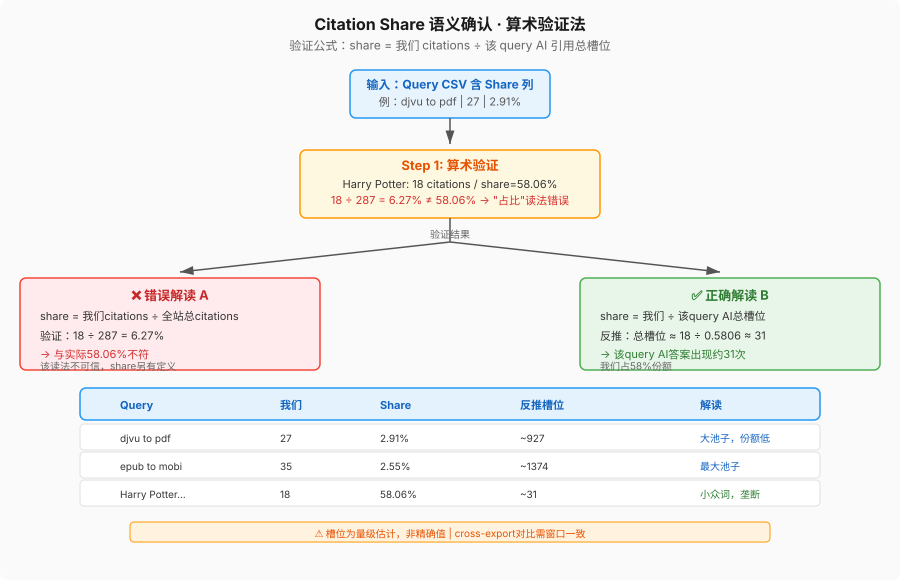
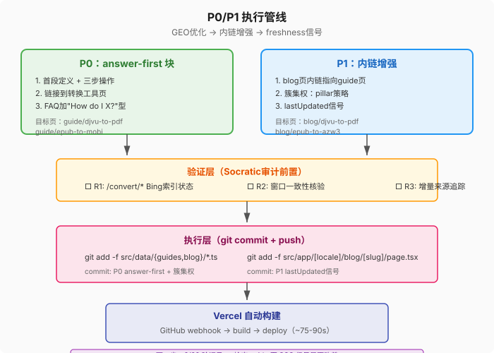
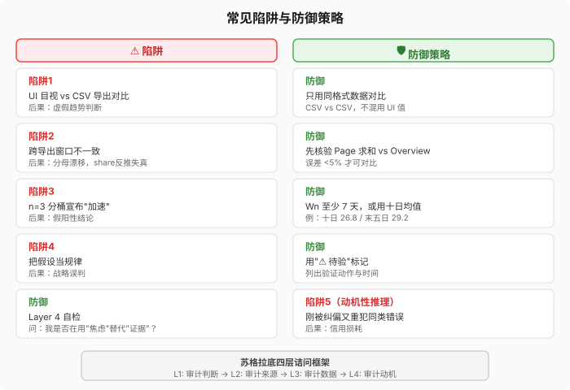

# 教材：Bing AI Performance 分析工作流

> 版本：v1.1  
> 生成日期：2026-08-27  
> 更新日期：2026-08-27（嵌入图示）  
> 适用场景：GEO（Generative Engine Optimization）内容策略与优化  
> 前置知识：SEO 基础、GSC 数据解读、Next.js 静态站点架构

---

## 一、背景与目标

### 什么是 Bing AI Performance？

Bing Webmaster Tools 提供的 **AI Performance** 面板，追踪 Bing Copilot/Bing Chat 在生成答案时引用我们网站的次数（Citations）。

| 指标 | 含义 |
|---|---|
| **Citations** | AI 答案中引用我们 URL 的次数 |
| **Cited Pages** | 被引用的不同页面数 |
| **Citation Share** | 我们的 citations ÷ 该 query 在 AI 答案中的总引用槽位（量级估计） |

### 为什么重要？

- **新兴流量源**：AI 搜索正在改变用户获取信息的方式
- **早期窗口期**：新站可能比成熟站点更容易进入 AI grounding 池
- **与 GSC 互补**：GSC 看传统搜索排名，AI Performance 看 AI 引用

---

## 二、数据拉取 SOP

### Step 1：导出三份 CSV

从 Bing Webmaster Tools → AI Performance 导出：

1. **Overview Stats** — 日级总量趋势
2. **Page Stats Report** — 各页面 citations
3. **Search Queries Report** — 各 query 的 citations + Citation Share

**⚠️ 关键**：每次导出必须**同时保存三份 CSV**，否则无法做跨期对比。

### Step 2：核对窗口一致性

```python
# 示例：用 Python 快速核验两份导出的窗口是否相同
import json

# 方案 A：通过 Page 报表求和反推
page_sum_25 = sum([97, 35, 25, ...])  # 8/25 导出 Top Pages
overview_total_25 = 249
diff_25 = overview_total_25 - page_sum_25
# 若 diff ≈ 0（如 2），说明 Page 报表覆盖全窗口

page_sum_27 = sum([102, 35, 29, ...])  # 8/27 导出
overview_total_27 = 287
diff_27 = overview_total_27 - page_sum_27
# 同样核对
```

**判准**：Page 报表求和 ≈ Overview 总量（误差 <5%）→ 窗口一致，可做增量对比。

### Step 3：识别增量来源

```python
delta = total_27 - total_25  # = 287 - 249 = 38
# 若 delta ≈ 单日 Overview 值（如 8/24 = 38），说明增量全来自最新一天
```

---

## 三、核心分析方法

### 方法 1：Citation Share 语义确认

当导出含 `Citation Share` 列时，先算术验证再下结论：

```python
# 错误解读：share = 占我们总 citatons 的比例
# 验证：Harry Potter query 有 18 citations，share = 58.06%
# 18 / 287 = 6.27% ≠ 58.06% → 该读法错误

# 正确解读：share = 我们 citations / 该 query AI 引用总槽位
# 反推：总槽位 ≈ 18 / 0.5806 ≈ 31 槽位
# 含义：该 query 在 AI 答案中出现约 31 次，我们占 58%
```

**输出格式**：

| Query | 我们 | Share | 反推总槽位 | 解读 |
|---|---|---|---|---|
| djvu to pdf | 27 | 2.91% | ~927 | 大池子，份额低 |
| Harry Potter... | 18 | 58.06% | ~31 | 小众词，我们垄断 |



### 方法 2：跨导出对比（⚠️ 易出错）

**常见陷阱**：把 UI 目视数据与 CSV 导出数据直接对比。

| 来源 | 可信度 |
|---|---|
| 本次导出的 CSV | ✅ 高（结构化数据）|
| 上次导出的 CSV | ✅ 高（但需核验窗口）|
| 之前分析的转述表格 | ⚠️ 中（可能含 UI 目视值）|
| 用户口头描述 | ❌ 低 |

**错误示范**：
```
"djvu to pdf: 12@2.88% → 27@2.91%"  # 误以为 share 稳定
```

**正确做法**：
```
- 8/25 导出缺 query/page CSV → 无法做跨导出 share 对比
- 本次仅能做总量与 page-level 对比（窗口已验证一致）
```

### 方法 3：页面级增量追踪

```python
# 对比两次导出的 Page 报表
delta_page = {page: new - old for page in new_pages if page in old_pages}
# 例：guide/djvu-to-pdf: 14 → 26 (+12)

# 标注首次进榜页面
new_entries = [p for p in new_pages if p not in old_pages]
# 例：txt-to-epub (5), mobi-to-kobo (5), blog/djvu-to-pdf (3)
```

---

## 四、苏格拉底审计框架

当报告产出行动建议后，用四层诘问压力测试：

### Layer 1：审计我自己的判断
- 我是否用了双重标准？（对别人要求高，对自己宽松）
- 我是否从 n=1 样本中过度概括？

**本次案例**：
- Q1：share 语义"确认" vs "最自洽推断"——我确认了吗？
- Q2：用不同窗口的 UI 数据对比 → 结论不成立

### Layer 2：审计共识与来源
- 我的"基线"数据本身可靠吗？
- 不同来源是独立验证，还是同一个叙事讲了四遍？

**本次案例**：
- 8/25 报告的 page 数字来自 UI 目视，未核对原始 CSV
- 我用"未核验的转述"当对比基线

### Layer 3：审计数据本身
- 数据冲突用"口径不同"解释，是否真能成立？
- 因果方向是否搞反了？

**本次案例**：
- "AI 只引信息页"规律被首页（工具页）29 citations 证伪
- 应先查 `/convert/*` 的 Bing 索引状态（R1），再定策略

### Layer 4：审计动机与框架
- 我是否在用"焦虑"替代"证据"？
- 基准预期（status quo = gap）未经检验？

**本次案例**：
- 刚被纠偏"撤销 301 是焦虑驱动"，转头就在 GEO 报告里塞反 301 证据
- 动机性推理复发，R7 撤回

---

## 五、裁决修正表（R1-R8）

| # | 原论断 | 修正后 | 依据 |
|---|---|---|---|
| R1 | share 语义"确认" | "最自洽推断"，槽位数降为量级估计 | Q1/Q2 |
| R2 | W4 "+34% 加速" | "十日 26.8/末五日 29.2，温和上行" | Q3 |
| R3 | "AI 只引信息页" → 不建工具页 | "低成本路径优先"，R1 索引核查前置 | Q4 |
| R4 | "djvu/epub 是 GEO 最大空间" | "可见 Top 8（覆盖 39% 引用）中最大" | Q6 |
| R5 | "djvu 已爆发，乘势集权" | "单日 +15 内部自洽，持续性待验" | Q8 |
| R6 | "9 页破纪录 = 广度扩展" | "观察项，非结论" | Q9 |
| R7 | "azw3 GEO 缺席 = 301 弱信号" | **撤回**，GEO 缺席度量主题需求 | Q10 |
| R8 | （无）| 补注：数据为 8/25 优化生效前快照 | Q12 |

---

## 六、P0/P1 执行模板

### P0：answer-first 块

**结构**：
```typescript
sections: [
  {
    heading: 'X to Y: the short answer',
    body: `**X** is ..., **Y** is ...  

Three steps:
1. Open [BookConv X to Y converter](/convert/x-to-y).
2. Upload and choose output format.
3. Download the result.

One caveat: ...`,
  },
  // ... 其余 sections
]
```

**要点**：
- 首段定义 + 三步 + 一个 caveat
- 链接到转换工具页（强化转化）
- FAQ 加"How do I X?"型问题（直击提问形态）

### P0：簇集权

**目标**：blog/ 页内链全部指向 guide/ 页（pillar 策略）

**改动**：
```typescript
// blog/djvu-to-pdf.ts
body: `... [Calibre](https://calibre-ebook.com) handles the same job on your desktop. 
For the full background, see our [DJVU to PDF guide](/guide/djvu-to-pdf).`
```

### P1：freshness signal

**最小改动方案**：
1. `types.ts`: 加 `lastUpdated?: string`
2. `page.tsx`: 渲染 `[date] · Updated [lastUpdated]` + dateModified JSON-LD
3. 具体博客文件：加 `export const lastUpdated = 'YYYY-MM-DD'`



---

## 七、常见陷阱与避坑指南



| 陷阱 | 后果 | 预防 |
|---|---|---|
| 用 UI 目视数据 vs CSV 导出数据对比 | 虚假趋势 | 只用同格式数据（CSV vs CSV）|
| 跨导出窗口不一致 | 分母漂移，share 反推失真 | 先核验 Page 求和 vs Overview 总量 |
| n=3 分桶宣布"加速" | 假阳性 | Wn 至少 7 天，或用十日均值 |
| 把假设当规律 | 战略误判 | 用"⚠️ 待验"标记，列出验证动作 |
| 刚被纠偏又重犯同类错误 | 信用损耗 | 自查"动机性推理"（Q10）|

---

## 八、数据文件清单

本工作流涉及的产出物（归档模板）：

```
数据分析/
  Bing_AI_Performance_分析_2026-08-27.md   ← 主报告（审计修订版）
  _gsc_daily_2026-08-2*.json             ← GSC 日级数据
  _guide_page_check_2026-08-*.json       ← guide 页级数据

geo/
  BingAI分析-2026-08-27.md               ← 审计文档（含 R1-R8 裁决表）
  bing数据/                              ← 原始 CSV 归档

src/data/guides/                         ← 修改的目标文件
src/data/blog/
src/app/[locale]/blog/[slug]/page.tsx
```

---

*教材版本：v1.1*  
*基于实战案例：2026-08-27 Bing AI Performance 分析 + 苏格拉底审计 + P0/P1 执行*  
*图示修正：2026-08-27（文字重叠问题修复）*
