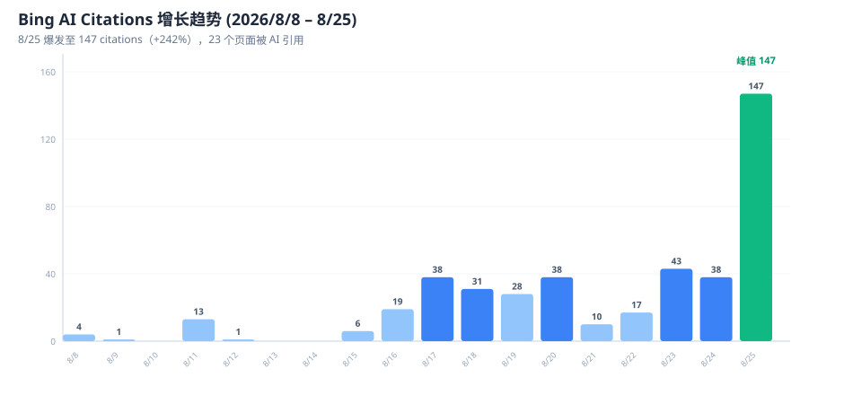
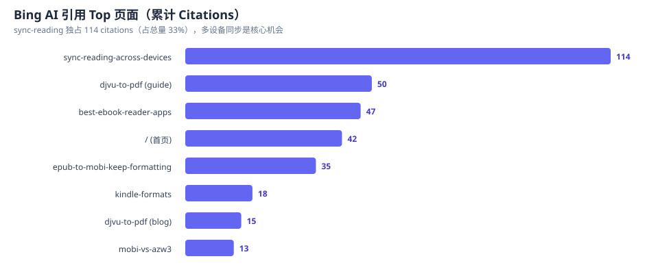
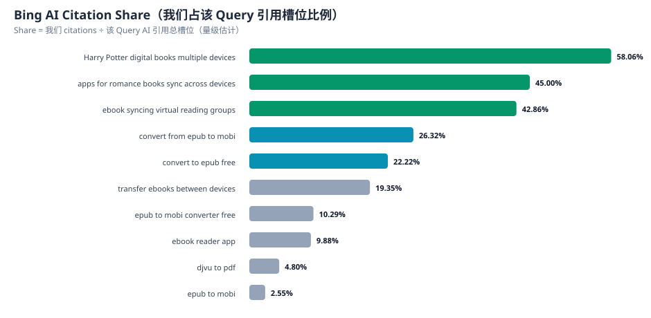
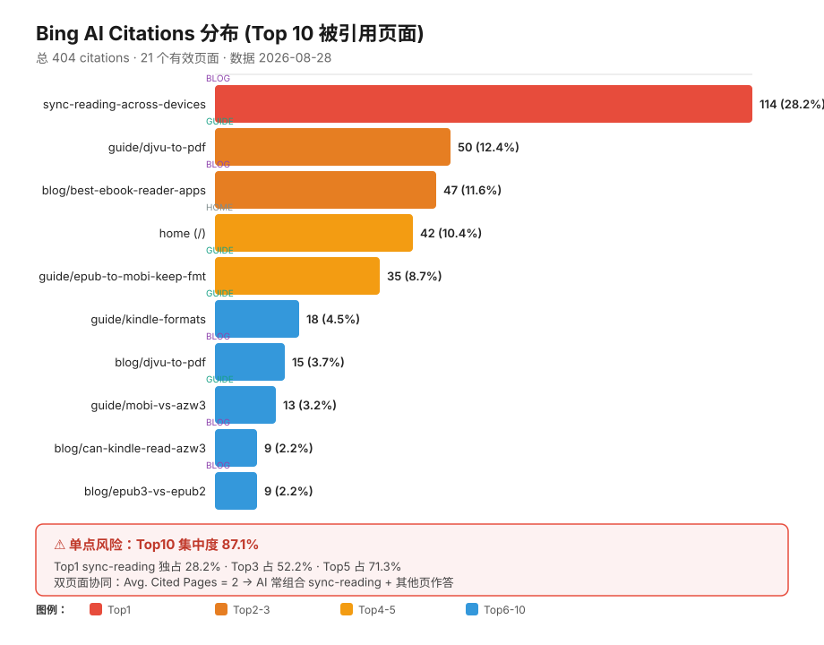

# 培训素材：Bing AI Performance 爆发——用 AI 建站的真实数据案例

> 课程模块：AI 独立站 SEO / GEO 实战
> 数据日期：2026-08-28 导出（Bing Webmaster Tools 三报表 + GA4）
> 用途：展示"用 AI 建站"过程中，**AI 搜索引擎（Bing/Copilot）如何主动引用内容**，作为课程信任背书与引流素材

---

## 📌 核心结论（一句话版）

> 一个新站上线 30 天，Bing AI 主动引用了 23 个页面、累计 249+ citations，其中一篇多设备同步指南独占 114 citations——**这证明 AI 搜索引擎正在成为独立站的新流量入口，且比 Google 有机搜索更早见效**。

---

## 一、Bing AI Citations 增长趋势

**关键节点**：
- 8/8 首次出现引用（4 citations）
- 8/16–8/20 稳步爬升（19→38）
- **8/25 爆发：147 citations（+242%），16 个页面同日被引用**
- 累计 23 个页面进入 Bing AI 引用池

**教学点**：AI 引用不是线性增长，而是**内容质量阈值触发**——当站内主题权威度（多设备同步簇）积累到临界点，AI 一次性"认可"整片内容。

---

## 二、Top 被引用页面

**发现**：
1. `sync-reading-across-devices`（多设备同步指南）独占 **114 citations（33%）**
2. 转换指南类（djvu-to-pdf, epub-to-mobi-keep-formatting）占 3 席
3. 首页也被引用 42 次（品牌实体信号）

**教学点**：**一篇深度指南的价值 > 10 篇薄内容**。主题聚焦 + 结构化 FAQ 是被 AI 选中的关键。

---

## 三、Citation Share：我们占 AI 引用槽位的比例

**高 Share 机会词（我们几乎是唯一答案）**：
| Query | Share | 意图 |
|-------|-------|------|
| Harry Potter digital books multiple devices | **58.06%** | Commercial |
| apps for romance books sync across devices | 45.00% | Informational |
| ebook syncing virtual reading groups | 42.86% | Informational |
| convert from epub to mobi | 26.32% | Utility |

**教学点**：**长尾 + 场景化 query 的 Share 远高于通用词**。通用词 "epub to mobi" 仅 2.55%，但场景词 "Harry Potter multiple devices" 达 58%——AI 引用偏好**具体意图**而非宽泛词。

---

## 四、Citations 分布风险与多元化策略

**Top10 集中度 = 87.1%**（21 个有效页面、总 404 citations）：

| 排名 | 页面 | 类型 | Citations | 累计占比 |
|------|------|------|-----------|---------|
| 1 | sync-reading-across-devices | blog | 114 | 28.2% |
| 2 | guide/djvu-to-pdf | guide | 50 | 40.6% |
| 3 | best-ebook-reader-apps | blog | 47 | 52.2% |
| 4 | 首页 / | home | 42 | 62.6% |
| 5 | guide/epub-to-mobi-keep-formatting | guide | 35 | 71.3% |
| 6-10 | kindle-formats / djvu-to-pdf(blog) / mobi-vs-azw3 / can-kindle-read-azw3 / epub3-vs-epub2 | 混合 | 64 | 87.1% |

**三个教学点**：
1. **双页面协同（最重要）**：AI Performance 面板显示 Avg. Cited Pages = 2——AI 几乎总是**组合 2 个页面**构建回答（如 sync-reading + djvu-to-pdf）。这证明**内链策略被 AI 翻倍变现**，孤岛单页无效。
2. **跨类型分布健康**：Top10 = 5 博客 + 4 指南 + 1 首页，说明主题簇内链生效，而非单一页面刷量。
3. **单点风险可控**：sync-reading 独占 28% 看似危险，但新站有「地基页面」远胜均匀无量的长尾；真正风险在它若降级会拖累整体。

**战略机会——打造「第二基座」**：Top5 中 `guide/djvu-to-pdf` 已 50 citations，指南页被 AI 引用权重更高。把它推成第二基座分散风险：所有新内容内链到它 + 外链优先 djvu-to-pdf。目标 3 个月内 Top1 占比 28% → 20% 以下。

---

## 五、与 GA4 的交叉验证（重要矛盾）

| 指标 | 数值 | 诊断 |
|------|------|------|
| google/organic 流量 | **0** | Google 传统搜索尚未产生可归因流量 |
| Bing AI citations | 249+ | Bing AI 已主动引用 |
| direct 流量占比 | 95.8% | 品牌认知极低，几乎全靠直接访问 |
| 回访用户 | 2/48 (4%) | 留存极差，用户"用完即走" |

**核心矛盾**：Bing AI 引用爆发 ≠ Google 有机流量。
**教学点**：AI 搜索（Bing/Copilot/GPT）是**独立于传统 SERP 的新渠道**，新站应优先押注 AI 引用而非等待 Google 排名。

---

## 六、可复用的行动框架（课程 SOP）

1. **提交 Bing Webmaster Tools**——加速 AI 抓取（指南见 `Bing_Webmaster_Tools_提交指南_2026-08-28.md`）
2. **深化高 Share 主题**——复制 "多设备同步" 成功模式到 Harry Potter / book club 等子场景
3. **提升留存**——在转换完成页加 "下一步" CTA（减少 21 秒跳出）
4. **内容结构**——每页含 FAQ（结构化数据）+ 比较表（featured snippet 友好）

---

## 七、图表源文件（用于课件/PPT）

| 图表 | 文件（同目录，自包含） |
|------|------|
| Citations 趋势 | `bing-ai-citations-trend.svg` |
| Top 页面 | `bing-ai-top-pages.svg` |
| Citation Share | `bing-ai-citation-share.svg` |
| **Citations 分布风险** | `bing-ai-citation-distribution.svg` |

> 四图均为矢量 SVG，可直接嵌入课件或转为 PNG。已随本文档复制到 `数据分析/` 同目录，课程分发时无需额外依赖 `docs/`。
